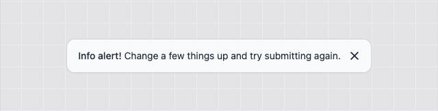
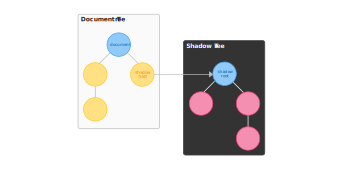
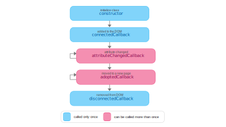

# You ~~may~~ don't need a javascript library for your components

Have you ever asked yourself how many times you wrote a Button component using different libraries or frameworks? Components are the base block of any Web project, and it is hard to reuse our components with all modern frameworks or keep updated with new releases. As a result, it increases the development time.

To solve this problem, Web Components can simplify this process since they work natively and can also be integrated with any js library. This series will explore the different aspects of building web components.

## What is a Web Component?

A Web Component is a way to create an encapsulated, single-responsibility code block that can be reused on any page. The main features you need to understand to start creating your own components are:

- HTML Templates
- Custom Elements
- Shadow DOM

## Create your Web Component



### HTML Template

With [HTML Templates](https://developer.mozilla.org/de/docs/Web/HTML/Element/template), you can create your template markup. However, you have to write your markup inside the <template> tag to use a template. The different aspect of the template is that it will be parsed but not rendered, so your template will appear in the DOM but not be presented on the page. To understand it better, let's look at the example below.

```html
<template>
    <div class="alert">
    <span class="alert__text">
      <slot></slot>
    </span>
        <button id="close-button" type="button" class="alert__button">
            <span class="sr-only">close</span>
            <svg class="h-5 w-5" fill="currentColor" viewbox="0 0 20 20" xmlns="http://www.w3.org/2000/svg">...</svg>
        </button>
    </div>
</template>
```

We add a template tag via code in this JavaScript file and assign the HTML content to the innerHTML property.

```javascript
const template = document.createElement('template');
template.innerHTML = /*html*/ `
<div class="alert">
  <span class="alert__text">
    <slot></slot>
  </span>
  <button id="close-button" type="button" class="alert__button">
    <span class="sr-only">close</span>
    <svg class="h-5 w-5" fill="currentColor" viewBox="0 0 20 20" xmlns="http://www.w3.org/2000/svg">
      <path fill-rule="evenodd" d="M4.293 4.293a1 1 0 011.414 0L10 8.586l4.293-4.293a1 1 0 111.414 1.414L11.414 10l4.293 4.293a1 1 0 01-1.414 1.414L10 11.414l-4.293 4.293a1 1 0 01-1.414-1.414L8.586 10 4.293 5.707a1 1 0 010-1.414z" clip-rule="evenodd"></path>
    </svg>
  </button>
</div>`;
```

### Define your Custom Element

To create [Custom Elements](https://developer.mozilla.org/en-US/docs/Web/Web_Components/Using_custom_elements), we need to define the name and a class object that represents the element's behavior. As a rule of thumb, you should add a prefix to your component to avoid clashes with the native HTML tags. So, in our example, we can add _ce_ (custom element) prefix in the name of our component like `ce-alert`.

#### Create a new Custom Element

We create a new class `Alert` inherited from HTMLElement and call the base constructor with the super inside our constructor method.

```javascript
const template = document.createElement('template');
//...
export class Alert extends HTMLElement {
  constructor() {
    super();
  }
}
```

#### Register a new Custom Element

Next, we use the `customElements.define` method to register our new component.

```javascript
const template = document.createElement('template');
//...
export class Alert extends HTMLElement {
//...
}
window.customElements.define('ce-alert', Alert);
```

#### Add behavior to the new Custom Element

Before we move forward, we need to understand some key concepts:

##### The Shadow DOM

A key aspect of web components is encapsulation — keeping the markup structure, style, and behavior hidden and separate from other code on the page so that different parts do not clash and the code can be kept nice and clean. The [Shadow DOM](https://developer.mozilla.org/en-US/docs/Web/Web_Components/Using_shadow_DOM) API is a crucial part of this, providing a way to attach a hidden separated DOM to an element.

Shadow DOM allows hidden DOM trees to be attached to elements in the regular DOM tree — this shadow DOM tree starts with a shadow root, underneath which can be attached to any elements you want, in the same way as the standard DOM.



Another essential feature of Shadow DOM is that it enables us to use a [`<slot>`](https://developer.mozilla.org/en-US/docs/Web/HTML/Element/slot) tag inside our markup and easily append the children elements inside our component.

##### The Element Lifecycle

You can define several different callbacks inside a custom element's class definition, which fire at other points in the element's lifecycle:



- `connectedCallback`: Invoked each time the custom element is appended into a document-connected element. Each time the node is moved, this may happen before the element's contents have been fully parsed.
- `disconnectedCallback`: Invoked each time the custom element is disconnected from the document's DOM.
- `adoptedCallback`: Invoked each time the custom element is moved to a new document.
- `attributeChangedCallback`: Invoked each time one of the custom element's attributes is added, removed, or changed. Which attributes to notice a change is specified in a static get `observedAttributes` method

Let's look at an example of these concepts in use.

```html
<ce-alert></ce-alert>
 ```

```javascript
//...
export class Alert extends HTMLElement {
  constructor() {
    super();
    const shadow = this.attachShadow({ mode: 'open' });
    shadow.appendChild(template.content.cloneNode(true));
  }
  connectedCallback() {
    const button = this.shadowRoot.getElementById(`close-button`);
    button.addEventListener('click', () => {
      this.dispatchEvent(new CustomEvent('close'));
      this.remove();
    }, { once: true });
  }
}
//...
```

The class constructor is simple — here, we attach a shadow DOM to the element. The shadow mode can be **open** or **closed**. In the **open** state, the element can be accessed outside the shadow root or vise-versa. So, for example, we could access the button inside our `ce-alert` component by doing the following query:

```javascript
document.querySelector('ce-alert').shadowRoot.querySelector('#close-button');
```

The updates are all handled by the life cycle callbacks, which are placed inside the class definition as methods. The `connectedCallback()` runs each time the element is added to the DOM — here, we add the click event function to remove the element when clicked.

#### Define attributes and properties

Attributes and properties work slightly differently from what we used to understand in a JS library/framework. Attributes are what you declare inside the HTML tag, and properties are part of the [HTMLElement](https://developer.mozilla.org/en-US/docs/Web/API/HTMLElement) class we extended, and when we define a new component, it already contains a set of properties defined. So sync attributes and properties can be achieved by reflecting properties to attributes. Let's demonstrate that with our example:

```html
<ce-alert color="red"></ce-alert>
 ```

It is crucial to notice that attributes are **always** strings. Therefore, you cannot define a method, object, or number. But, in case you need another type, you have to cast it later or declare it directly inside the element object.

Now to sync the attribute with the property in the class:

```javascript
//...
export class Alert extends HTMLElement {
//...
  set color(value) {
    this.setAttribute('color', value);
  }

  get color() {
    return this.getAttribute('color');
  }

  connectedCallback() {
    console.log(this.color); // outputs: "red"
  }
}
//...
```

Although this approach works, it can become verbose or tedious as more and more properties our components have. Still, there is an alternative that does not require declaring all properties manually: The [HTMLElement.datasets](https://developer.mozilla.org/en-US/docs/Web/API/HTMLElement/dataset) interface provides read/write access to custom data attributes (`data-*`) on elements. It exposes a map of strings (DOMStringMap) with each `data-*` attribute entry. Updating our example with the dataset declaration:

```html
<ce-alert data-color="red"></ce-alert>
 ```

```javascript
//...
export class Alert extends HTMLElement {
//...
  connectedCallback() {
    console.log(this.dataset.color); // outputs: "red"
  }
}
//...
```

#### Sync Properties and Attributes (Bonus)

In case you want to do the sync between attributes and properties, here is a function that can simplify this process:

```javascript
/**
 * @param target - the custom element class
 * @param props - properties which needs to be synced with the attributes
 */
const defineProperties = (target, props) => {
  Object.defineProperties(
    target,
    Object.keys(props).reduce((acc, key) => {
      acc[key] = {
        enumerable: true,
        configurable: true,
        get: () => {
          const attr = target.getAttribute(getAttrName(key));
          return (attr === '' ? true : attr) ?? props[key];
        },
        set: (val) => {
          if (val === '' || val) {
            target.setAttribute(getAttrName(key), val === true ? '' : val);
          } else {
            target.removeAttribute(key);
          }
        }
      };
      return acc;
    }, {})
  );
};
```

### Observe Properties and Attributes

To detect attributes or property changes, we just need to return an array with all values we want using the static method `observedAttributes`. Next, we configure our callback function `attributeChangedCallback` to define what will happen when the defined property changes.

```javascript
//...
export class Alert extends HTMLElement {
//...
  static observedAttributes() {
    return ['data-color'];
  }
  attributeChangedCallback(name, prev, curr) {
    if (prev !== curr) {
      this.shadowRoot.querySelector('.alert').classList.remove(prev);
      this.shadowRoot.querySelector('.alert').classList.add(curr);
    }
  }
}
//...
```

### Final Result

To complete, here is the final result of our new Web Component:

```javascript
const template = document.createElement('template');
template.innerHTML = /*html*/ `
<div class="alert">
  <span class="alert__text">
    <slot></slot>
  </span>
  <button id="close-button" type="button" class="alert__button">
    <span class="sr-only">close</span>
    <svg class="h-5 w-5" fill="currentColor" viewBox="0 0 20 20" xmlns="http://www.w3.org/2000/svg">
      <path fill-rule="evenodd" d="M4.293 4.293a1 1 0 011.414 0L10 8.586l4.293-4.293a1 1 0 111.414 1.414L11.414 10l4.293 4.293a1 1 0 01-1.414 1.414L10 11.414l-4.293 4.293a1 1 0 01-1.414-1.414L8.586 10 4.293 5.707a1 1 0 010-1.414z" clip-rule="evenodd"></path>
    </svg>
  </button>
</div>`;

export class Alert extends HTMLElement {
  static observedAttributes() {
    return ['data-color'];
  }
  constructor() {
    super();
    const shadow = this.attachShadow({ mode: 'open' });
    shadow.appendChild(template.content.cloneNode(true));
  }
  connectedCallback() {
    const button = this.shadowRoot.getElementById(`close-button`);
    button.addEventListener('click', () => {
      this.dispatchEvent(new CustomEvent('close'));
      this.remove();
    }, { once: true });
  }
  attributeChangedCallback(name, prev, curr) {
    if (prev !== curr) {
      this.shadowRoot.querySelector('.alert').classList.remove(prev);
      this.shadowRoot.querySelector('.alert').classList.add(curr);
    }
  }
}

window.customElements.define('ce-alert', Alert);
```

As you probably notice, we are still missing the styling of your component, but we will tackle it next.

### Browser Integration

We can now use our Custom Element in our HTML file. To integrate, we must import the js file as a [module](https://developer.mozilla.org/en-US/docs/Web/JavaScript/Guide/Modules#applying_the_module_to_your_html).

```html
<html>
  <head>
    <!--...-->
    <script type="module" src="./alert.js"></script>
  </head>
  <body>
    <ce-alert></ce-alert>
  </body>
</html>
```

### Problems and Issues

There are good aspects of using Web Components as it can work everywhere, is small, and runs faster as it uses built-in platform APIs. But it is not only flowers, and there are also some things which might not work as you expected.

#### Attributes vs Properties

A downside of using attributes in a custom element is that it accepts only strings, and syncing the properties with the attributes requires manual declaration.

#### Component Update

Custom elements can detect if an attribute changes, but what happens next is up to the developer to define.

#### Styling

Styling can be problematic and tricky since the component is encapsulated.

#### Forms

Using forms with custom elements requires some [custom form association](https://developer.mozilla.org/en-US/docs/Web/API/HTMLElement/attachInternals) to make it work.

#### No SSR Support

Due to the nature of a Web Component, it cannot be used in an SSR page since Web Components rely on browser-specific DOM APIs, and the Shadow DOM cannot be represented declaratively, so it cannot be sent as string format.

## Styling your Components

In a Web Component, there are 3 ways of defining a style:

* **Inline Style**
* **CSS Import**
* **Link Reference**

In addition to the conventional [CSS selectors](https://developer.mozilla.org/en-US/docs/Web/CSS/CSS_Selectors), Web Components supports the following ones:

* [:host/:host(selector-name)](https://developer.mozilla.org/en-US/docs/Web/CSS/:host) -> Selects the shadow host element or if it has a certain class.
* [:host-context(selector-name)](https://developer.mozilla.org/en-US/docs/Web/CSS/:host-context) -> Selects the shadow host element only if the selector given as the function's parameter matches the shadow host's ancestor(s) in the place it sits inside the DOM hierarchy.
* [::slotted()](https://developer.mozilla.org/en-US/docs/Web/CSS/::slotted) -> Selects a slotted element if it matches the selector.
